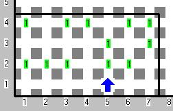
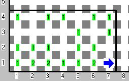

        
<h3>Descripción</h3>

En esta 11° OMI Karel se encuentra en peligro, ya que ha sido blanco de los ataques del maléfico Chuzpa, para sobrevivir, al menos durante este problema, Karel debe huir a través de un campo de zumbadores avanzando desde la pared sur del campo hasta la pared norte, si Karel alcanza la pared norte quedará salvado.

A partir de su segunda fila (contando de sur a norte), el campo se encuentra salpicado de beepers que representan maleficios. Karel puede huir utilizando únicamente aquellos espacios en donde no hay maleficio.

<h3>Problema</h3>

Dado un campo rectangular, rodeado en su totalidad por paredes, encuentra la secuencia de movimientos que Karel necesita realizar para alcanzar la pared norte del campo. Tu programa deberá escribir la secuencia de movimientos en la primera fila del campo, dejando un montón de beepers por cada movimiento de la siguiente manera:

<strong>1 beeeper</strong> representa un movimiento hacia el oeste, <strong>2 beepers</strong> un movimiento hacia el norte, y<strong> 3 beepers</strong> un movimiento hacia el este. La secuencia de movimientos deberá comenzar en la coordenada (1,1) y continuar sin dejar ningún espacio en blanco.

<h3>Ejemplo</h3>

<h3>Consideraciones</h3>
<ul>
<li>Karel tiene infinitos beepers en la mochila</li>
<li>Karel se encuentra en cualquier lugar de la fila 1 orientado hacia el norte</li>
<li>Para los casos de prueba siempre habrá una forma de alcanzar la pared norte</li>
<li>Karel es inteligente y sabe que es inútil pasar dos veces por el mismo lugar</li>
<li>Si hay más de una forma (que cumpla con la consideración anterior), cualquiera que describas será considerada correcta</li>
<li>No importan la orientación ni la posición final de Karel</li>
<li>Los movimientos al sur no están permitidos</li>
<li>Todos los casos de prueba tendrán al menos una solución cuya secuencia de pasos sea menor o igual a la longitud de la primera fila</li>
</ul>

                    

            

