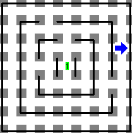
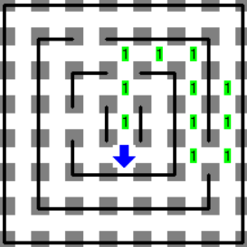

        
<h3>Descripción</h3>

Estando en el país de Creta, Kareleseo se vio en la necesidad de derrotar al minotauro del laberinto. El minotauro vive en el centro de un laberinto formado por cuadrados concéntricos, es decir, uno dentro otro. Los cuadrados tienen ancho uno y están limitados por paredes. Cada cuadrado está conectado con el cuadrado inmediatamente menor por exactamente dos puertas. Cada una de estas puertas tiene un ancho exactamente de uno y pueden estar colocadas en cualquier lugar a lo largo de la pared que une ambos cuadrados. Las puertas nunca están en las esquinas. El cuadrado exterior del laberinto no tiene ninguna puerta en su pared externa.

Muchos antes que Kareleseo han intentado sin éxito recorrer el laberinto para derrotar al minotauro. El secreto de Kareleseo, será dejar un hilo amarrado para no perderse. Para no arriesgarse a que se termine el hilo, Kareleseo quiere tomar, en cada cuadrado, el camino más corto que lo lleve a una de las puertas que conectan con el siguiente cuadrado.

<h3>Problema</h3>

Escribe un programa que le ayude a Kareleseo a, en cada cuadrado, encontrar la puerta más cercana que lo lleva al siguiente cuadrado hasta llegar al minotauro.

Kareleseo deberá dejar un camino de montones de 1 zumbador desde su posición inicial hasta el centro del laberinto, que representa el hilo.

<h3>Consideraciones</h3>
<ul>
<li>Karel inicia en algún lugar del cuadro exterior del laberinto.</li>
<li>Karel NO inicia junto a una puerta.</li>
<li>Karel lleva un número infinito de zumbadores en la mochila.</li>
<li>El minotauro el cual siempre estará en el centro del laberinto, se representa como un montón de 1 zumbador.</li>
<li>Para obtener puntos en este problema, Karel debe dejar un camino de montones de 1 zumbador desde su posición de inicio hasta el centro del laberinto.</li>
<li>No importa la posición ni la dirección final de Karel</li>
<li># Ejemplo</li>
</ul>
<h4>Mundo inicial</h4>

El mundo inicial muestra a Karel fuera del laberinto y el minotauro en el centro.

<h4>Mundo final</h4>

                    

            

