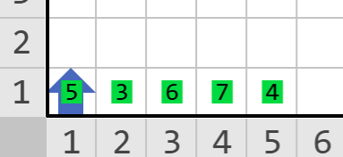
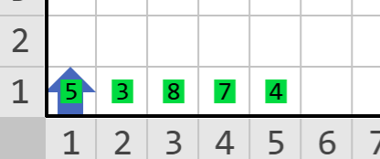
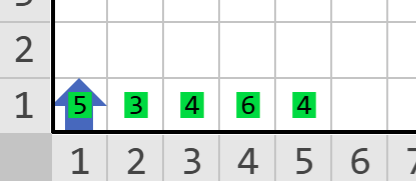

        

Karel es un ávido coleccionista de tarjetas de súper héroes. Ayer decidió desempolvar su colección de los <strong>Karel-Vengers</strong>. Al abrir la caja dónde las tenía descubrió que las tarjetas están desordenadas e incompletas <strong>:(</strong>.

La colección de tarjetas completa tiene 100 tarjetas numeradas del 1 al 100.

Resignado a que algunas tarjetas se le han perdido, Karel quiere saber 2 cosas:

<ul>
<li>Si tiene tarjetas repetidas.</li>
<li>Si las tarjetas que todavía le quedan son continuas en numeración.</li>
</ul>

En la primera fila del mundo de Karel, iniciando en la columna 1 habrá montones de zumbadores. Cada montón representa el número de una tarjeta. Los números pueden ir desde 1 hasta 100. Las tarjetas están una junto de otra, es decir, no hay espacios con 0 zumbadores entre las tarjetas.

<h3>Problema</h3>

Escribe un programa que, dada la lista de tarjetas verifique si Karel tiene tarjetas repetidas y si las tarjetas de Karel están continuas en numeración.

Si Karel tiene <strong>REPETIDAS</strong> o sus tarjetas <strong>NO SON CONTINUAS</strong> entonces deberá apagarse orientado al <strong>SUR</strong>.

Si Karel <strong>NO TIENE REPETIDAS</strong> y sus tarjetas<strong> SON CONTINUAS EN NUMERACIÓN</strong> entonces deberá apagarse orientado al <strong>NORTE</strong>.

<h3>Consideraciones</h3>
<ul>
<li>Karel empieza en la posición (1,1) orientado al norte.</li>
<li>Karel inicia con 0 zumbadores en su mochila.</li>
<li>La primera tarjeta siempre está en la posición (1,1).</li>
<li>El mundo mide 100 filas por 100 columnas y no tiene paredes internas.</li>
<li>Para obtener puntos <strong>Karel debe apagarse viendo al SUR si hay REPETIDAS o NO SON CONTINUAS u orientado al NORTE si NO HAY REPETIDAS y todas SON CONTINUAS.</strong></li>
<li>No importan la posición final de Karel ni los zumbadores que dejes en el mundo.</li>
<li>En este problema los casos se agruparán de modo que cada grupo contenga al menos un caso cuya solución es terminar orientado al norte y un caso cuya solución sea terminar orientado al sur.</li>
</ul>
<h3>Ejemplo1</h3>

En este ejemplo Karel tiene las tarjetas <strong>3, 4, 5, 6 y 7. NO HAY REPETIDAS y TODAS SON CONTINUAS</strong>. Por lo tanto Karel debe apagarse orientado al <strong>NORTE</strong>.

<h3>Ejemplo2</h3>

En este ejemplo Karel tiene las tarjetas <strong>3, 4, 5, 7 y 8. NO HAY REPETIDAS</strong> pero <strong>FALTA LA TARJETA 6</strong>. Por lo tanto Karel debe apagarse orientado al <strong>SUR</strong>.

<h3>Ejemplo3</h3>

En este ejemplo Karel tiene las tarjetas <strong>3, 4, 4, 5 y 6</strong>. La tarjeta <strong>4</strong> está <strong>REPETIDA</strong>. Por lo tanto Karel debe apagarse orientado al <strong>SUR</strong>.

                    

            

