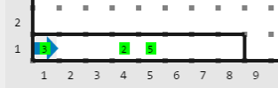
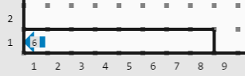
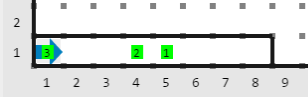
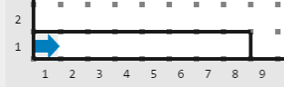
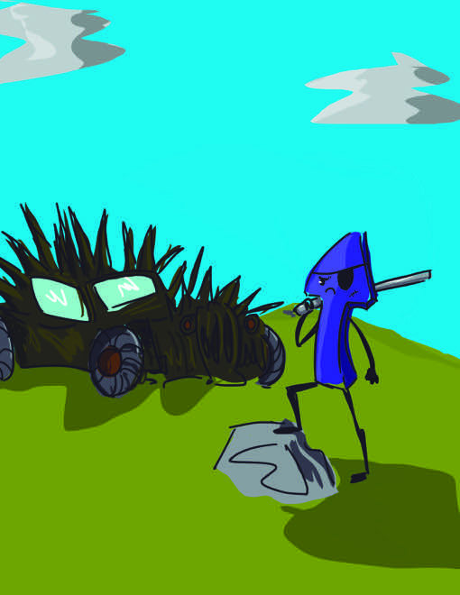

        
<h3>Historia</h3>

Karel y Warel, enemigos eternos e igual de poderosos, han decidido ponerle fin a su épica pelea.

Karel y Warel mantendrán un duelo en la primera fila del mundo.  Por suerte, Karel se ha enterado de la estrategia que usará Warel  durante el duelo y ahora quiere saber si podrá derrotarlo.

El resultado de la lucha entre Karel y Warel depende de la energía que cada uno tenga, sin embargo, la energía de Warel disminuye conforme se mueve en el mundo. El duelo inicia en la casilla (1, 1) del mundo y se recorre una casilla a la derecha cada turno. Cada que Warel se mueve una casilla a la derecha, su energía disminuye en 1. Al llegar a la nueva casilla, puede haber un módulo de recarga que estará representado por un montón de zumbadores, en caso de que lo haya, Warel lo usa y su energía aumenta en una cantidad igual al número de zumbadores del montón. Si en algún momento la energía de Warel disminuye a 0 y no hay ningún módulo de recarga, Warel no puede continuar el duelo.

Karel logró encontrar un mapa que dice dónde habrá módulos de recarga y cuánta energía tendrán.  Usando este mapa, Karel desea saber si Warel tendrá energía suficiente para recorrer todo el mundo y si la tiene, saber cuál será la cantidad máxima de energía que tendrá durante la duración del duelo.

Warel inicia el duelo con energía 0.

<h3>Problema</h3>

Escribe un programa que dado el mapa de los módulos de recarga determine si Warel tendrá suficiente energía para recorrer el mundo y si la tiene cuál será la máxima cantidad de energía que llegará a tener.

Tu programa deberá dejar en la casilla (1, 1) una cantidad de zumbadores igual a:

<ul>
<li><em>Cero</em>: Si Warel no tendrá energía suficiente para recorrer el mundo, es decir, si en algún momento su energía llegará a cero sin que tenga un módulo de recarga.</li>
<li>La cantidad máxima de energía que Warel llegué a tener en el caso de que Warel nunca llegué a quedarse sin energía.</li>
</ul>
<h3>Consideraciones</h3>
<ul>
<li>Karel inicia en la posición (1,1) con orientación desconocida.</li>
<li>Para obtener los puntos de este problema no importa la posición ni orientación final de Karel, solo los zumbadores que queden en la casilla (1,1).</li>
<li>En este problema habrá diferentes subtareas que varían dependiendo de la cantidad de zumbadores que Karel lleva en la mochila y dimensiones del mundo.</li>
</ul>
<h3>Subtareas</h3>
<h5>Subtarea 1 (17 puntos)</h5>
<ul>
<li>Karel inicia con infinitos zumbadores en la mochila.</li>
<li>El mundo de Karel tiene 100 casillas de altura.</li>
<li>La primera fila tiene 100 casillas de largo.</li>
</ul>
<h5>Subtarea 2 (21 puntos)</h5>
<ul>
<li>Karel inicia con infinitos zumbadores en la mochila.</li>
<li>El mundo de Karel tiene 2 casillas de altura.</li>
<li>La primera fila tiene una longitud variable.</li>
</ul>
<h5>Subtarea 3 (23 puntos)</h5>
<ul>
<li>Karel inicia con infinitos zumbadores en la mochila.</li>
<li>El mundo de Karel tiene 1 casilla de altura.</li>
<li>La primera fila tiene una longitud variable.</li>
</ul>
<h5>Subtarea 4 (39 puntos)</h5>
<ul>
<li>Karel inicia con 0 zumbadores en la mochila.</li>
<li>El mundo de Karel tiene 1 casilla de altura.</li>
<li>La primera fila tiene una longitud variable.</li>
</ul>
<h3>Ejemplo 1</h3>
<h5>Entrada</h5>

<h5>Salida</h5>

_En este ejemplo, la energía de Warel nunca llega a cero, y la cantidad máxima de energía que llegó a tener fue de 6 en la casilla 5. Por lo tanto Karel debe dejar 6 zumbadores en la casilla (1,1)._

<h3>Ejemplo 2</h3>
<h5>Entrada</h5>

<h5>Salida</h5>

_En este ejemplo, la energía de Warel llega a cero antes de que pueda llegar al final del mundo, por lo que tu programa debe dejar cero zumbadores en la casilla (1, 1)._

                    

            

