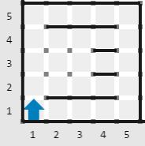
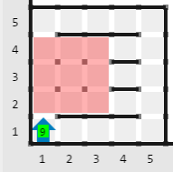

        
<h3>Historia</h3>

Recientemente, en una audaz estrategia de expansión, el Grupo Karso ha decidido construir un nuevo mega centro comercial en la ciudad de Veracruz.

Sin embargo, Veracruz es una ciudad que ya cuenta con muchos edificios construidos, y para hacer que el mega centro comercial sea lo más mega posible, se le ha encomendado a Karel Mosby, arquitecto, la importante tarea de encontrar el área de superficie cuadrada más grande posible donde el nuevo centro comercial pueda ser construido.

Para realizar esta tarea, Karel cuenta con un mapa de Veracruz donde cada edificio se representa por una pared horizontal (<strong>No existe ninguna pared vertical dentro del mundo</strong>).

<h3>Problema</h3>

Escribe un programa que encuentre, en el mapa, el área cuadrada más grande que no tenga ningún edificio construido. Tu programa debe dejar en la casilla (1, 1) un montón de zumbadores igual al área de dicho cuadrado.

<h3>Consideraciones</h3>
<ul>
<li>Karel inicia en la posición (1, 1) viendo al norte.</li>
<li>Karel inicia con infinitos zumbadores en la mochila.</li>
<li>El mundo de Karel puede ser rectángular, mide como máximo 50 x 50 y está delimitado por paredes.</li>
<li>No existen paredes verticales adentro del mundo que representa Veracruz.</li>
<li>El área que buscas debe ser cuadrada.</li>
<li>Para obtener los puntos de este problema no importan la posición ni orientación final de Karel, solo los zumbadores en la casilla (1, 1).</li>
</ul>
<h3>Ejemplo</h3>
<h5>Entrada</h5>

<h5>Salida</h5>

_En el ejemplo de salida, y solo para fines informativos, el área cuadrada más grande (que consta de 9 casillas) se encuentra resaltada en color rojo._

                    

            

