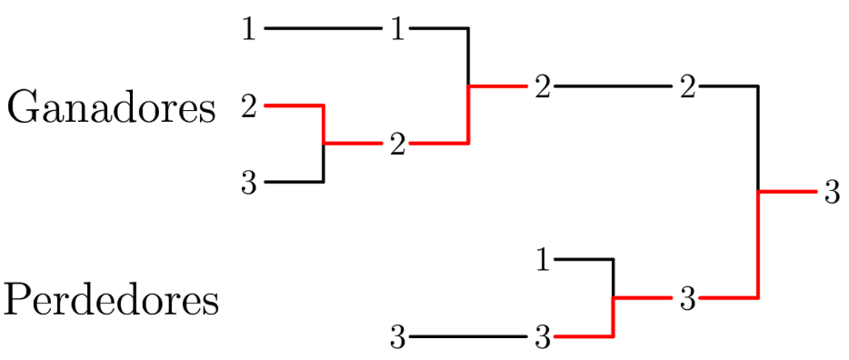

        

Juan y sus amigos se van a dividir en \(n\) equipos para jugar un torneo de fútbol. En el torneo va a haber un grupo de ganadores y uno de perdedores. Inicialmente todos los equipos pertenecen al grupo de los ganadores.

En cada ronda del torneo, sucede lo siguiente mientras haya un grupo con <strong>al menos</strong> 2 equipos.

<ul>
<li>Los equipos que son parte del grupo de los perdedores se emparejan. Cada pareja juega una partida en la que no hay empates. Si un equipo gana, se queda en el grupo de los perdedores. Por el contrario, si un equipo pierde, al acabar la ronda queda eliminado del torneo. Si hubo un equipo que no quedó emparejado durante la ronda (y por ende no jugó una partida), se queda en el grupo de los perdedores.</li>
<li>Los equipos que son parte del grupo de los ganadores se emparejan. Cada pareja juega una partida en la que no hay empates. Si un equipo gana, se queda en el grupo de los ganadores. Por el contrario, si un equipo pierde, al acabar la ronda se pasa al grupo de los perdedores. Si hubo un equipo que no quedó emparejado durante la ronda (y por ende no jugó una partida), se queda en el grupo de los ganadores.</li>
</ul>

Después de varias rondas, cada grupo queda con un solo equipo. Los dos equipos juegan la partida final y se decide el ganador del torneo.

Determina para la cantidad de equipos dada cuántas partidas se jugaron en total. Se te garantiza que sin importar cómo se haya emparejado a los equipos y quiénes ganaron o perdieron, la respuesta será la misma.

<h3>Entrada</h3>
<ul>
<li>La primera línea tiene un entero \(n\) que representa la cantidad de equipos que juegan en el torneo.
# Salida
Un único entero que indica la cantidad total de partidas que se jugaron durante el torneo.</li>
</ul>
<h3>Ejemplos</h3>
<h4>Ejemplo 1</h4>
<h5>Entrada</h5>

<pre><code>2</code></pre>
<h5>Salida</h5>

<pre><code>2</code></pre>
<h4>Ejemplo 2</h4>
<h5>Entrada</h5>

<pre><code>3</code></pre>
<h5>Salida</h5>

<pre><code>4</code></pre>

A continuación se muestra una ilustración del segundo ejemplo:

Observa que se jugaron 4 partidas en total.

<h3>Consideraciones</h3>
<ul>
<li>\(1 \leq n \leq 10^9\)</li>
</ul>
<h3>Subtareas</h3>
<ul>
<li>Subtarea 1 (10 puntos): \(n = 8\)</li>
<li>Subtarea 2 (15 puntos): \(n \leq 1000\)</li>
<li>Subtarea 3 (25 puntos): \(n \leq 10^5\)</li>
<li>Subtarea 4 (50 puntos): <strong>Sin restricciones adicionales.</strong></li>
</ul>

                    

            

