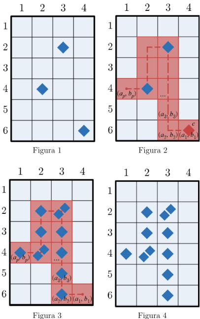

        

¡Mimo y Yuyú acaban de terminar su rompecabezas de 1000 piezas! Sin embargo, eso viene con su inconveniente: ya no saben qué jugar. Pero de alguna manera han conseguido inventar un juego nuevo. Para jugar este juego, se necesita de un suministro infinito de galletas María y un tablero rectangular de tamano \(n × m\). Cada celda del tablero puede contener cualquier cantidad de galletas María.

Las filas del tablero están nombradas de la \(1\) a la \(n\) de arriba hacia abajo. También están nombradas las columnas del tablero de la \(1\) a la \(m\) de izquierda a derecha. Se usará \((u, v)\) para referirse a la celda en la fila \(u\) y columna \(v\). Al inicio, hay \(k\) galletas María, la \(i-ésima\) galleta María está ubicada en \((x_i , y_i)\).

Mimo y Yuyú ahora juegan el juego alternando turnos. En su turno, el jugador elige una galleta María \(g\) que esté actualmente en el tablero y, al mismo tiempo, elige un camino de <strong>celdas</strong> distintas \((a_1 , b_1)\), \((a_2 , b_2)\), . . . \((a_p , b_p)\) tal que se cumplan las siguientes condiciones:

<ul>
<li>\(p \geq 2\)</li>
<li>\(g\) tiene que estar en la celda \((a_1 , b_1)\)</li>
<li>Para toda \(i\) \((1 \leq i \leq p)\), \(|a_i + 1 - a_i| + |b_i + 1 - b_i| = 1\). Es decir, cualquier par de celdas que sean adyacentes en la secuencia lo tienen que ser en el camino.</li>
<li>\(b_1 \geq b_2 \geq . . . \geq b_p\). Es decir, las <strong>columnas</strong> de las celdas del camino tienen que formar una secuencia <strong>no-aumentante</strong>. </li>
<li>\(b_p = 1\). Es decir, la ´ultima celda del camino tiene que pertenecer a la columna \(1\).</li>
<li>\(b_1 &gt; b_2\). De hecho, \(b_2 = b_1 - 1\). Es decir, \((a_1 , b_1)\) tiene que ser la ´unica celda del camino que pertenece a la columna \(b_1\).</li>
</ul>

Luego, se come la galleta \(g\) del tablero y añade \(1\) galleta Marpia a cada una de las celdas \((a_2 , b_2)\), \((a_3 , b_3)\), . . . \((a_p , b_p)\). Esto concluye su turno.

En el juego, pierde quien no puede hacer ningún movimiento (es decir, que no puede elegir ninguna galleta María \(g\) junto con una secuencia que cumpla todas las condiciones). Tanto Mimo como Yuyú son muy competitivos, y no cometerán ningún error al jugar; es decir, juegan óptimamente. Determina quién gana si Mimo empieza jugando.

Por ejemplo, considera un juego donde \(n = 6, m = 4\), y existen actualmente \(3\) galletas Marías en \((2, 3), (4, 2)\) y \((6, 4)\) (como se ve en la <strong>Figura 1</strong>). Un turno válido podría ser elegir \(g\) como la galleta María en \((6, 4)\) y la sequence de celdas con \(p = 10\) definida por \(a = [6, 6, 5, 4, 3, 2, 2, 3, 4, 4]\) y \(b = [4, 3, 3, 3, 3, 3, 2, 2, 2, 1]\).

Para efectos de claridad, una línea punteada se muestra en la <strong>Figura 2</strong> que pasa a través de esta elección particular de \((a_1 , b_1)\), \((a_2 , b_2)\), . . . \((a_p , b_p)\) en orden. <strong>La figura 3 y 4</strong> muestran el estado del juego después de que ocurre el turno, con y sin el resaltado del camino respectivamente.

       

Imprime <strong><em>Mimo</em></strong> si Mimo gana, o <strong><em>Yuyu</em></strong> si Yuyú gana.

<h3>Entrada</h3>
<ul>
<li>La primera línea contiene \(t\) que representa el número de casos de prueba.</li>
<li>La primera línea de cada de caso de prueba contiene tres enteros \(n\), \(m\), y \(k\).</li>
<li>Las \(i-ésima\) de las siguientes \(k\) líneas contienen dos enteros \(x_i\) y \(y_i\).</li>
</ul>
<h3>Salida</h3>

Para cada caso de prueba imprime una línea: <strong><em>Mimo</em></strong> si Mimo gana, o <strong><em>Yuyu</em></strong> si Yuyú gana.

<h3>Ejemplos</h3>
<h4>Ejemplo 1</h4>
<h5>Entrada</h5>

<pre><code>1
2 3 2
2 2
1 3</code></pre>
<h5>Salida</h5>

<pre><code>Mimo</code></pre>
<h4>Ejemplo 2</h4>
<h5>Entrada</h5>

<pre><code>2
6 4 3
2 3
4 2
6 4
6 4 11
6 3
5 3
4 3
3 3
2 3
2 3
2 2
3 2
4 2
4 2
4 1</code></pre>
<h5>Salida</h5>

<pre><code>Mimo
Yuyu</code></pre>
<h3>Consideraciones</h3>

Sea \(S_k\) la suma de \(k\) sobre todos los casos de prueba.

<ul>
<li>\(1 \leq t \leq 104\).</li>
<li>\(1 \leq n, m, k \leq 2 × 10^5\).</li>
<li>\(S_k \leq 2 × 10^5\).</li>
<li>\(1 \leq x_i \leq n\) \((1 \leq i \leq k)\).</li>
<li>\(1 \leq y_i ≤ m\) \((1 \leq i \leq k)\).</li>
</ul>
<h3>Subtareas</h3>
<ul>
<li>Subtarea 1 <strong>(12 puntos):</strong> \(n = 2\), \(m = 3\) y \(k \leq 3\).</li>
<li>Subtarea 2 <strong>(12 puntos):</strong> \(m \geq 2\) y \(y_i = 2\) \((1 \leq i \leq k)\). Es decir, las \(k\) galletas Marías inician en la columna \(2\).</li>
<li>Subtarea 3 <strong>(12 puntos):</strong> \(k = 1\).</li>
<li>Subtarea 4 <strong>(12 puntos):</strong> \(k = 2\).</li>
<li>Subtarea 5 <strong>(12 puntos):</strong> \(n \geq 2\) y \(y_i = y_j\) \((1 \leq i, j \leq k)\). Es decir, las \(k\) galletas Marías inician en la misma columna.</li>
<li>Subtarea 6 <strong>(25 puntos):</strong> \(n = 1\).</li>
<li>Subtarea 7 <strong>(15 puntos):</strong> \(n \geq 2\).</li>
</ul>

                    

            

