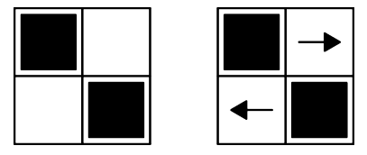
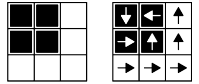

        
<h3>Descripción</h3>

Este problema iba ser la clase de historia de Juan, que se iba a tratar sobre la IOI de \(1997\) en Sudáfrica. Sin embargo, la lección fue censurada por el resto del comité, y así llegó a ti el siguiente enunciado:

Abraham es un valiente explorador que va a donde ningún programador ha ido antes. En su siguiente expedición, planea investigar un laberinto muy curioso. Él sabe que el laberinto es una cuadrícula de \(n * n\) que tiene una flecha en cada casilla. Cada flecha apunta en una de 4 direcciones posibles: arriba, abajo, izquierda o derecha. Si Abraham pisa una casilla, es forzado a seguir las flechas desde esa casilla. Cada flecha mueve a Abraham una casilla en la dirección en la que apunta y si llega a una flecha que apunta hacia afuera del laberinto, él podrá escapar.

Abraham no sabe cómo están orientadas las flechas del laberinto, pero tiene otro tipo de información. En su mapa del laberinto, algunas casillas están pintadas de negro y otras de blanco. El cree que las casillas negras cumplen que si pisa en cualquiera de ellas inicialmente, nunca podrá escapar del laberinto, mientras que si pisa cualquier casilla blanca, en algún momento podrá escapar.

La suposición de Abraham podría ser incorrecta, pues hay ciertos acomodos de casillas negras y blancas para los cuales es imposible que se cumplan las condiciones especificadas para todas las casillas simultáneamente, sin importar cómo estén orientadas las
flechas. La siguiente imagen es un ejemplo de esto.

Se muestra un mapa que representa un laberinto en el cual las casillas blancas pueden satisfacer lo que Abraham supone. Si él se para en cualquiera de ellas, las flechas mostradas lo sacan del laberinto, pero es imposible que se quede atrapado al iniciar en una casilla negra sin importar qué orientaciones le demos a las flechas no mostradas.

<h3>Problema</h3>

Abraham te pide que lo ayudes diciéndole si para una cierta coloración de las casillas en su mapa existe un acomodo de flechas que concuerda con su creencia para cada casilla de la cuadrícula (tanto negra como blanca).

<h3>Entrada</h3>
<ul>
<li>La primera línea contiene un entero positivo \(n\).</li>
<li>Cada una de las siguientes \(n\) caracteres, cada uno \(0\) o \(1\). \(0\) denota una casilla negra y \(1\) una casilla blanca. Estas \(n\) líneas descruben la cuadrícula.</li>
</ul>
<h3>Salida</h3>

Imprime \(SI\) si se pueden orientar las flechas de forma que Abraham nunca pueda escapar al pararse inicialmente en una casilla negra y que eventualmente escapa si inicialmente se para en una casilla blanca.

Imprime \(NO\) si lo anterior no es posible.

<h3>Ejemplos</h3>
<h4>Entrada</h4>

<pre><code>3
001
001
111</code></pre>
<h4>Salida</h4>

<pre><code>SI</code></pre>
<h4>Entrada</h4>

<pre><code>2
01
10</code></pre>
<h4>Salida</h4>

<pre><code>NO</code></pre>

El primer ejemplo corresponde a la siguiente coloración (mostrada en la izquierda) junto con un acomodo posible de orientaciones de las flechas:

El segundo ejemplo se mencionó en la historia del problema como un caso en que es imposible satisfacer lo pedido para todas las casillas al mismo tiempo.

<h3>Límites</h3>
<ul>
<li>\(2 \leq n \leq 1000\).</li>
</ul>
<h3>Subtareas</h3>
<ul>
<li>Subtarea \(1\) (\(10\) puntos): \(n = 2\).</li>
<li>Subtarea \(2\) (\(25\) puntos): Se garantiza que las casillas negras forman una región conexa y que al menos dos esquinas del laberinto son negras.</li>
<li>Subtarea \(3\) (\(25\) puntos): Se garantiza que las casillas blancas forman una región conexa y que menos de \(4n - 4\) celdas son negras.</li>
<li>Subtarea \(4\) (\(40\) puntos): Sin restricciones adicionales.</li>
</ul>
<h3>Nota</h3>

Un conjunto de casillas forma una región conexa si existe un camino (moviéndose entre casillas que comparten un borde) entre cada par de ellas que solo pasa por casillas del conjunto. En particular, las casillas negras forman una región conexa si entre cada par de casillas negras hay un camino que solo pasa por casillas negras. Similarmente, las casillas blancas forman una región conexa si entre cada par de casillas blancas hay un camino que solo pasa por casillas blancas.

En el primer caso de ejemplo, tanto las casillas blancas como las negras forman una región conexa.

En el segundo caso de ejemplo, las casillas negras no forman una región conexa porque cualquier camino entre ellas pasa por una casilla blanca también.

                    

            

